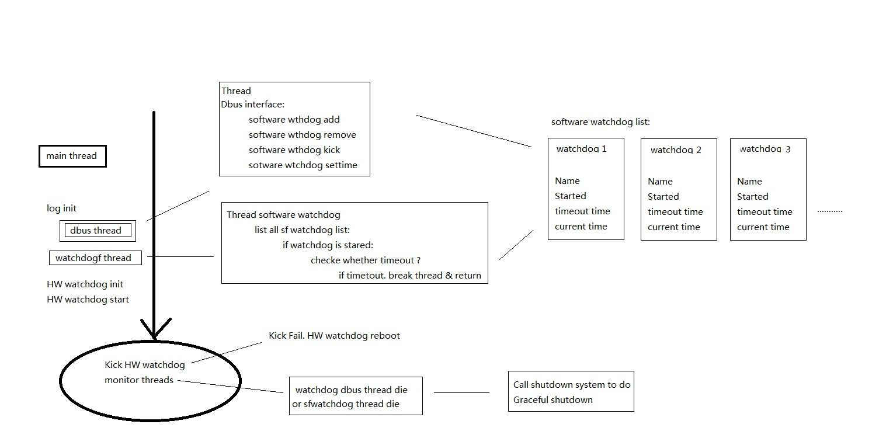

# Omni-WatchDogFrame — A Cross-Platform Hybrid Watchdog Framework for Embedded Reliability

## Overview

Omni-WatchDogFrame is a hybrid software-hardware watchdog framework designed to provide high-reliability process supervision across heterogeneous embedded platforms.
While most embedded systems expose only a single hardware watchdog device, Omni-WatchDogFrame virtualizes this mechanism and builds a multi-layer software watchdog infrastructure on top of it, enabling unlimited software-level watchdog instances for different modules, threads, or critical services.

Hybrid Two-Layer Watchdog Architecture

The framework operates by combining:

A hardware watchdog (HW-WDT)
– the final fail-safe mechanism, responsible for system-level recovery;

A software watchdog subsystem (SW-WDT)
– flexible, dynamic, and capable of supervising any number of software components.

The software layer continuously monitors active processes/threads and reports their status to the hardware watchdog.
If any critical software watchdog fails, times out, or its supervision thread dies, the framework intentionally stops kicking the hardware watchdog, allowing the hardware watchdog to perform a clean system reset.

This ensures strict “fail-safe by design” behavior.

The framework has been successfully validated on multiple platforms, including:

- **x86 Linux**
- **NVIDIA Jetson Xavier**
- **Raspberry Pi (all models)**

These tests confirm that the architecture is portable and behaves consistently across different hardware and Linux kernel implementations.

## Platform Considerations

Some embedded Linux distributions automatically enable system-level or vendor-specific watchdog services that take ownership of the hardware watchdog device (e.g., `/dev/watchdog0`).  
To run Omni-WatchDogFrame correctly, the hardware watchdog must be released so the framework can take exclusive control.

Different platforms or Linux distributions may require different steps to disable or release the default watchdog service.  
Consult your platform documentation if you find that `/dev/watchdog0` is occupied at system boot.

---

## Cross-Platform Abstraction Layer 

Omni-WatchDogFrame uses a unified hardware watchdog abstraction.  
Any platform—standard or non-standard—can integrate with the framework by implementing a minimal hardware watchdog class with the following methods:

python
__init__(self, path)
kick(self)
sett(self, timeout)
close(self)

## Beyond Watchdogs: A General Reliability Architecture

Although originally designed for watchdog supervision, the architectural model is applicable to any scenario requiring:

Multi-process or multi-thread health monitoring

Distributed component heartbeat tracking

Fail-safe control logic

System recovery coordination

Reliability enforcement in complex embedded applications

The framework can be viewed as a generalized reliability layer—a foundation for building resilient, self-monitoring embedded systems.

## License

This project is licensed under the Apache License 2.0 with an additional attribution requirement.

You must retain the following author credit in all copies or substantial portions of the software:

    Original Author: Wenjie Zhang

See the [LICENSE](./LICENSE) file for full details.

